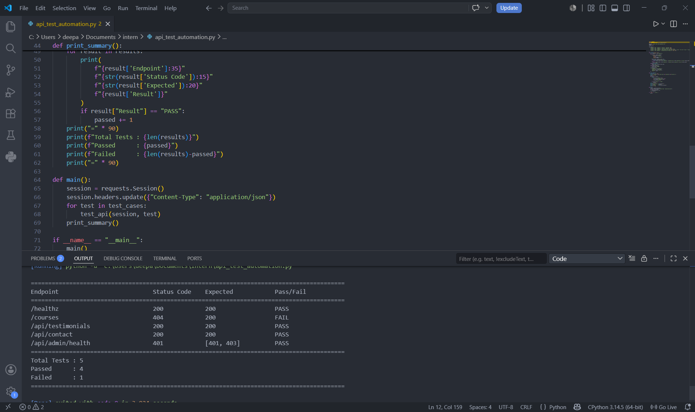

# API Automation Testing

This project demonstrates automated API testing using Python and the Requests library. The script sends requests to multiple API endpoints, validates the expected HTTP status codes automatically, handles network errors gracefully, and prints a summary table showing the endpoint, status code, expected result, and pass/fail outcome.

## Files Included

- `api_test_automation.py` – Python automation script
- `Screenshot_api.png` – Screenshot of the script execution

## Output Screenshot

## Reflection

Building this API automation script helped me understand that automated testing is faster and more efficient than manually testing APIs in Postman. The script automatically checks the expected status codes, records the results, and generates a clear pass or fail summary without requiring manual verification. It also handles network errors gracefully and can be run repeatedly whenever changes are made to the API, making regression testing much easier. Overall, automated testing saves time, reduces human error, and provides consistent and reliable results compared to manual testing in Postman.
