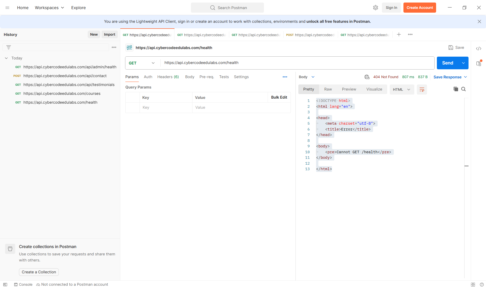

# API Testing Using Postman — Submission Report

## Overview

In this task, I used Postman to test multiple REST API endpoints. I performed GET and POST requests, analyzed HTTP status codes, and studied JSON responses to understand how APIs function.

---

## Result Table

| Endpoint                 | Method | URL                                                                                                    | Status Code | Response                                   | Pass/Fail | Notes                                            |
| ------------------------ | ------ | ------------------------------------------------------------------------------------------------------ | ----------- | ------------------------------------------ | --------- | ------------------------------------------------ |
| Health Check             | GET    | [https://api.cybercodeedulabs.com/health](https://api.cybercodeedulabs.com/health)                     | 404  Not Found       | Cannot GET /health                         | Fail      | Server returned 404 Not Found with response body ‘Cannot GET /health’, indicating that the endpoint is not defined or not available for GET request.|
| Get all courses          | GET    | [https://api.cybercodeedulabs.com/courses](https://api.cybercodeedulabs.com/courses)                   | 404 Not Found      | Cannot GET /courses                        | Fail      | Server returned 404 Not Found with response body ‘Cannot GET /courses’, indicating that the endpoint is not defined or not available for GET request.                  |
| Get testimonials         | GET    | [https://api.cybercodeedulabs.com/api/testimonials](https://api.cybercodeedulabs.com/api/testimonials) | 200 OK         | JSON object with success=true and testimonials array | Pass      | Successfully returned list of testimonials from server           |
| Contact form             | POST   | [https://api.cybercodeedulabs.com/api/contact](https://api.cybercodeedulabs.com/api/contact)           | 200 OK        | {"success":true,"message":"Message received. We'll be in touch soon!"}                      | Pass      | Successfully submitted contact form data and received confirmation response      |
| Admin health (protected) | GET    | [https://api.cybercodeedulabs.com/api/admin/health](https://api.cybercodeedulabs.com/api/admin/health) | 401 Unauthorized        | {"error":"Missing token"}                              | Pass      | Endpoint is protected and correctly requires authentication token       |

---

## Screenshot(Postman Interface)

In Postman, the interface shows the request method dropdown (GET/POST) on the left of the URL bar, the request URL field in the center, and a blue “Send” button on the right. Below the URL section are tabs such as Params, Authorization, Headers, Body, and Tests. After sending each request, the response panel appears at the bottom showing the HTTP status code, response time, and JSON or HTML response body. For successful requests, JSON data is displayed, while failed requests show error messages such as “Cannot GET” or “Internal Server Error.”

---

## What I Learned

Through this task, I learned how REST APIs work and how to test them using Postman. I understood how to:

* Send GET requests to retrieve data from a server
* Send POST requests to submit data
* Read and interpret HTTP status codes (200, 404, 500, 401)
* Understand JSON response structures
* Identify differences between working and broken endpoints
* Recognize protected APIs that require authentication tokens

I also learned that:

* 200 means success
* 404 means endpoint not found
* 500 means server error
* 401 means unauthorized access

Postman is a powerful tool for testing and debugging APIs without writing code.

---

## Conclusion

This exercise helped me understand how APIs communicate between client and server. It also demonstrated how real-world APIs handle success responses, errors, and authentication requirements. Using Postman made it easier to visualize and test API behavior in a structured way.

---
